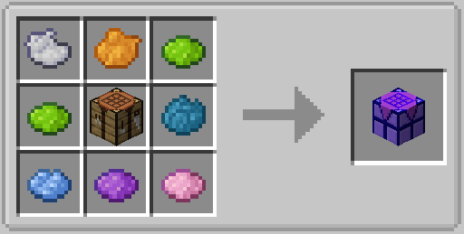
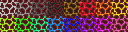
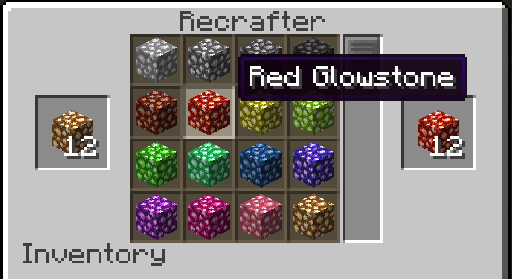

  

**Epitheca** is a mod that adds a variety of new craftable variants of existing blocks and items.  
It is currently heavily WIP, and as such, many features are not yet implemented.  
Available for download on [Curseforge](https://www.curseforge.com/minecraft/mc-mods/epitheca) and [Modrinth](https://modrinth.com/mod/epitheca). Thank you for over 150 downloads!   
  
  
  
To get started with the mod, simply make the Recrafter and use it to convert blocks to their Epitheca variants!  

  
## Features  
- [x] Shroomlight Variants  

- [x] Glowstone Variants  

- [X] Magma Variants  

- [X] Iron Door Variants (Cobblestone, Mossy Cobblestone, Cobbled Deepslate, Smooth Stone, Gold, Diamond, Emerald)  

- [X] Bar Variants (Cobblestone, Mossy Cobblestone, Cobbled Deepslate, Smooth Stone, Gold, Diamond, Emerald)

- [X] Carved Pumpkin / Jack O' Lantern Variants  

- [X] Make a "recrafter" block that can convert minecraft blocks to Epitheca variants and vice versa 

- [ ] Real recrafter recipes as opposed to whatever I'm doing right now  
- [ ] Recipe book for recrafter recipes
- [ ] JEI Integration for Recrafter recipes  
- [ ] More Pumpkin / Jack O' Lantern Variants  
- [ ] Froglight Variants  
- [ ] Barrel Variants  
- [ ] Moss Variants  
- [ ] Replace natural generation of some blocks with a chance of being a variant? This one is a stretch
- [ ] More to come!
