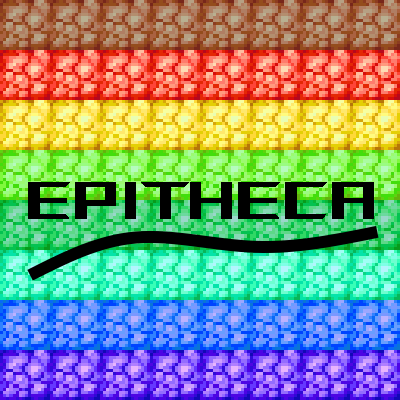

  

**Epitheca** is a mod that adds a variety of new craftable variants of existing blocks and items.  
It is currently heavily WIP, and as such, many features are not yet implemented.  

## Features  
- [x] Shroomlight Variants  

- [x] Glowstone Variants  

- [ ] Magma Variants  
- [ ] Froglight Variants  
- [ ] Pumpkin / Carved Pumpkin / Jack O' Lantern Variants  
- [ ] Barrel Variants  
- [ ] Moss Variants  
- [ ] Replace natural generation of some blocks with a chance of being a variant? This one is a stretch
- [ ] More to come!